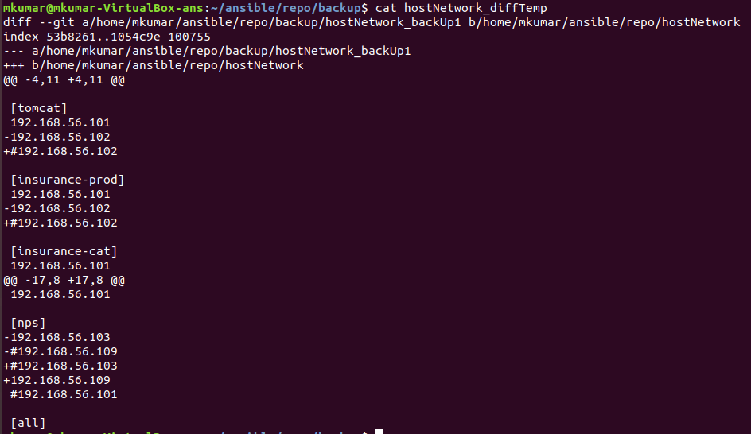

# Host-Inventory-Provisioning
A File containing a list of applications hosted on Organization servers
---

We are asking host-inventory file from source-control (GIT in this case). This will gives flexibility to developers for add/remove of containers and make them CI pipeline ready. This is equivalent to a list of applications hosted on Organization's server. Ansible will also install git along with performing other tasks.

Example of host inventory file:


Variables related to git login/project name/locations are stored at **_/group_vars/all.yaml_** file
>Control machine: host-inventory file: **_/ansible/repo/hostNetwork_**
>Control machine: host-inventory for deletion of hosts file: **_/ansible/repo/hostNetwork_hostForDeletion_**
>Control machine: back-ups of host-inventory file: **_/ansible/repo/hostNetwork/backup_**
>File to read from reository is; repoRemoteFile: **_test.txt_**.


* role: role name is git.
* hosts: localhost = this tells that this playbook will not look for hosts-inventory rather it will get executed on this local machine. So yeah Ansible can run without a host-inventory file. 
* Do not run this playbook in conjunction with other playbooks.


### The overall structure looks like


and


```
file: playbook.yaml
Directories:
  * roles (need for input to playbook)
  * group_vars (need for input to playbook)
  * ansible (created on control machine for output by playbook)
      * repo
          * backup
```


# How to run playbook

```
ansible-playbook gitPlaybook.yaml -K
```
Where
```-k``` = ask for privilege escalation password.


This is what resulted at Control machine(localhost machine, where provisioning is being done).

/ansible


/ansible/repo

host files lives here


/ansible/repo/backup


The first Backup


The difference of Backups, so we can track what is changing b/w subsequent **_git pull_**.
  
